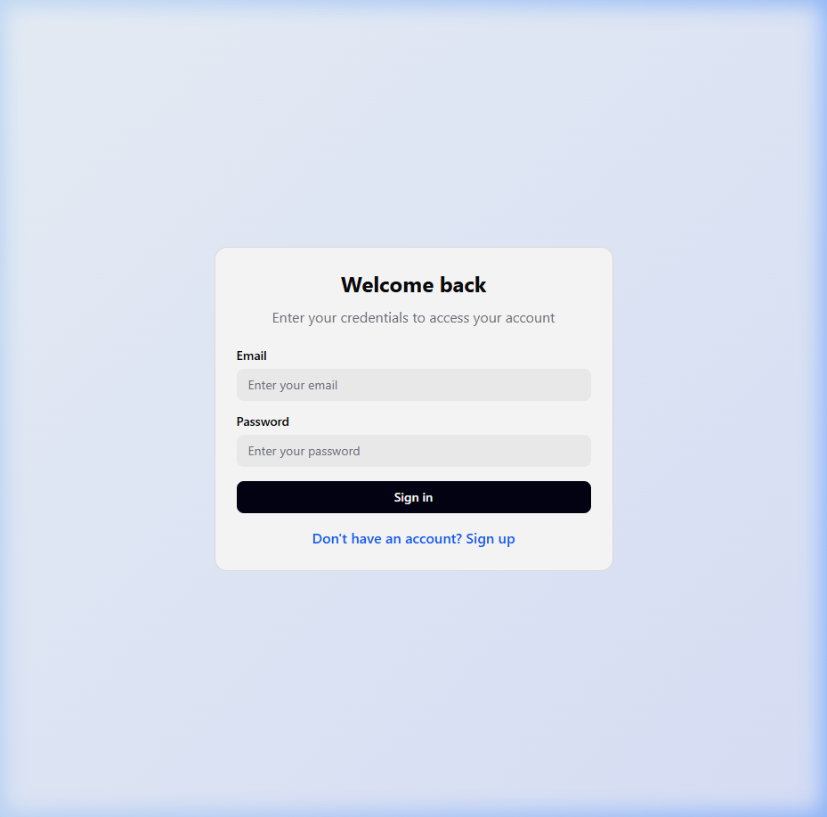
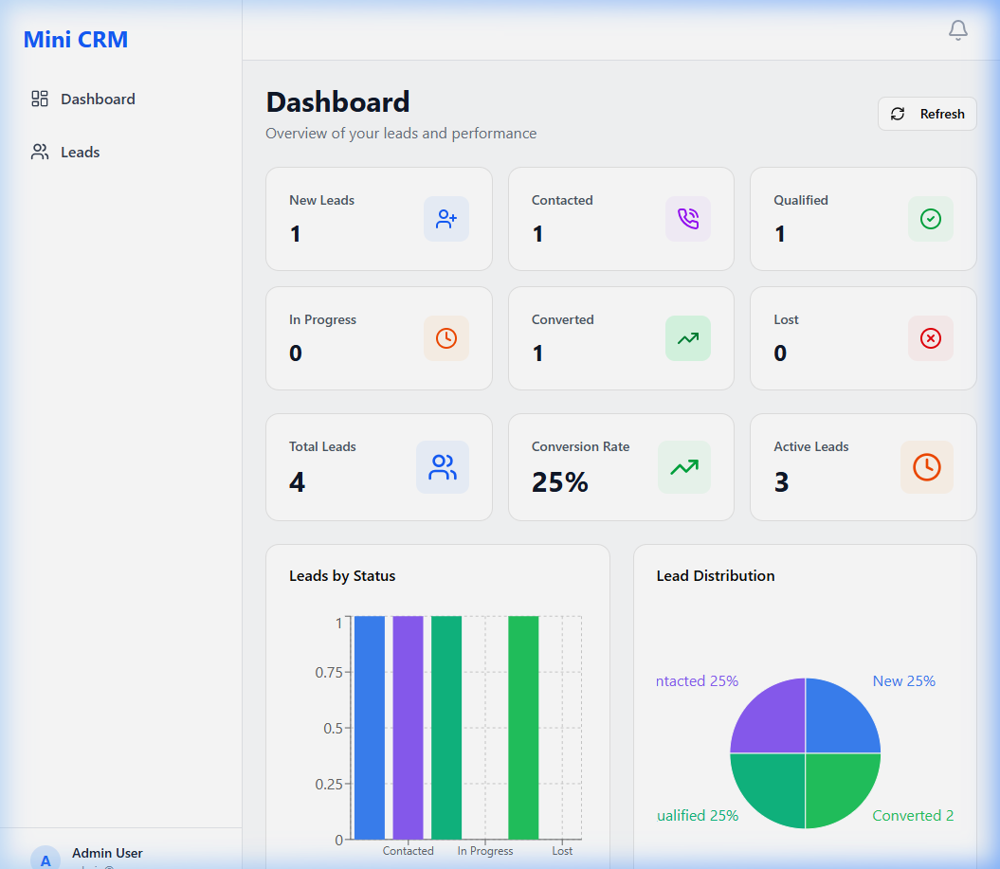
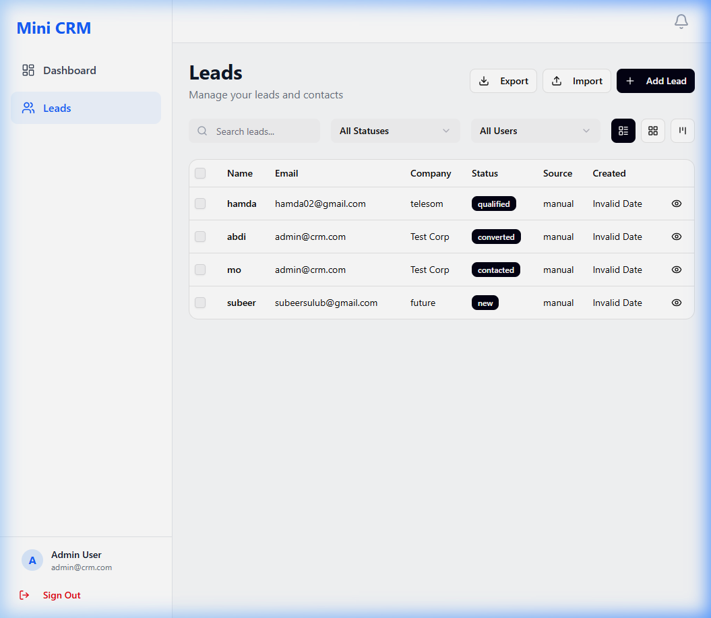
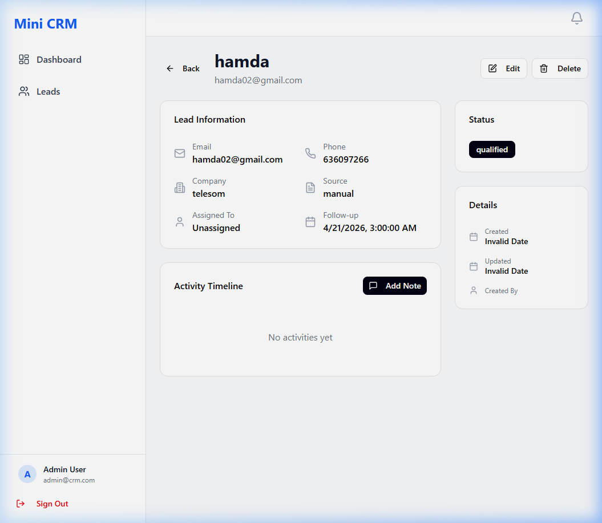

# Mini CRM - Full-Stack Lead Management System

A professional, high-fidelity CRM system built with the MERN stack (MySQL, Express, React, Node.js). This application provides a comprehensive suite of tools for managing leads, tracking activities, and analyzing performance.

## 🚀 Features

### 🔐 Authentication & Security
- **Secure Login/Signup**: JWT-based authentication system.
- **Role-Based Access**: Basic role management for administrators and users.
- **Protected Routes**: Ensuring data privacy across the application.

### 📊 Professional Dashboard
- **Real-Time Analytics**: Visual breakdown of leads by status.
- **Interactive Charts**: Bar and Pie charts for distribution analysis.
- **Manual Data Refresh**: One-click refresh with visual feedback.
- **Performance Metrics**: Automatic calculation of conversion rates and active pipelines.

### 👥 Lead Management
- **Universal Leads View**: Switch between **Table**, **Card**, and **Kanban** views.
- **Advanced Filtering**: Filter by Status, Search query, and Assigned User.
- **Lead Assignment**: Assign specific leads to team members.
- **Follow-up Reminders**: Set specific dates for lead follow-ups.
- **Bulk Actions**: Delete or update status for multiple leads at once.

### 📝 Activity Tracking & Timeline
- **Interaction History**: Automatic logging of all lead updates.
- **Notes with Attachments**: Add rich text notes and **attach files/documents** to any lead.
- **Chronological Timeline**: See the entire history of a lead at a glance.

### 📥 Data Portability
- **CSV Import**: Bulk import leads from any standard CSV file.
- **CSV Export**: Export your entire lead list for external analysis.

## 🛠️ Tech Stack
- **Frontend**: React, Vite, TailwindCSS, Lucide Icons, Recharts, React-Router v7.
- **Backend**: Node.js, Express, Sequelize ORM.
- **Database**: MySQL.
- **State Management**: React Context API for Authentication.

## ⚙️ Installation & Setup

### Prerequisites
- Node.js (v18+)
- MySQL Server

### 1. Backend Setup
```bash
cd server
npm install
```
Create a `.env` file in the `server` directory:
```env
DB_NAME=crm_db
DB_USER=root
DB_PASS=yourpassword
DB_HOST=localhost
JWT_SECRET=your_secret_key
PORT=5000
```
Run the server:
```bash
npm run dev
```

### 2. Frontend Setup
```bash
# In the root directory
npm install
npm run dev
```
The app will be available at `http://localhost:5173` (or the port specified by Vite).

## 📸 Visual Showcase

### 🔐 Login Page

*A sleek, minimal entrance with blueprint-inspired design and secure JWT authentication.*

### 📊 Professional Dashboard

*Bento-style analytics with real-time performance charts and one-click data refresh.*

### 👥 Leads Management

*Comprehensive lead tracking with status filters, user assignment, and follow-up reminders.*

### 📝 Lead Detail & Timeline

*Deep dive into lead history with activity logs and file attachments.*

---
Developed with ❤️ for a professional CRM experience.
